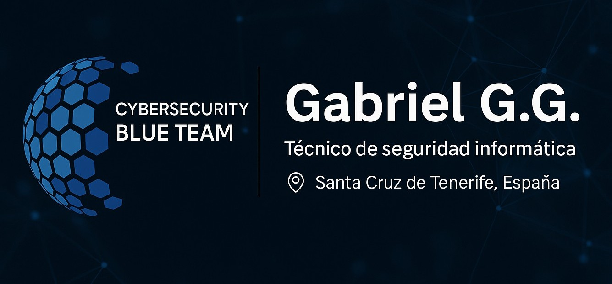

<h1>Hey, I am Gabriel!</h1>
<h2>🧠 About Me</h2>

I’m a Security Blue Team enthusiast with hands-on experience in monitoring, detection, and forensic analysis. 
My background combines technical curiosity with a methodical approach to threat identification, system hardening, 
and incident response. I'm particularly interested in SOC operations, digital forensics and adversary simulation.

 

<h2>🔍 Projects & Labs</h2>
<ul>
  <li><strong>Analysis with Splunk:</strong> Detected brute-force attempts using correlation rules and dashboarding</li>
  <li><strong>Memory Forensics with Volatility:</strong> Extracted indicators of compromise from memory dumps</li>
  <li><strong>Disk Triage with Autopsy & KAPE:</strong> Analyzed file system artifacts in a simulated insider threat case</li>
  <li><strong>Phishing Triage:</strong> Decoded obfuscated URLs and extracted payload indicators from malicious emails</li>
  <li><strong>Security audit simulation:</strong> Conducted endpoint and network analysis and reported system misconfigurations and anomalies</li>
  <li><strong>Deploying Windows Server and Configuring Active Directory:</strong> Set up domain services, users, and group policies in a lab environment</li>
</ul>

 

<h2>🛠️ Technical Skills</h2>

  <!-- Sistemas operativos -->
  
  

  <!-- Hacking y análisis de red -->
  
  
  
  
  
  
  <!-- Blue Team / Forense -->
  
  
  
  

  <!-- Admin / IT / Infra -->
  
  

  <!-- Dev y scripting -->
  
  
  
  

  <!-- AI -->
  

 

<h2>🤝 Soft Skills</h2>
<ul>
  <li>Clear and structured incident reporting</li>
  <li>Effective communication during escalation</li>
  <li>Team collaboration under pressure</li>
  <li>Self-learning and adaptability to evolving threats</li>
</ul>

 

<h2>⚡️ Contact me</h2>

 
